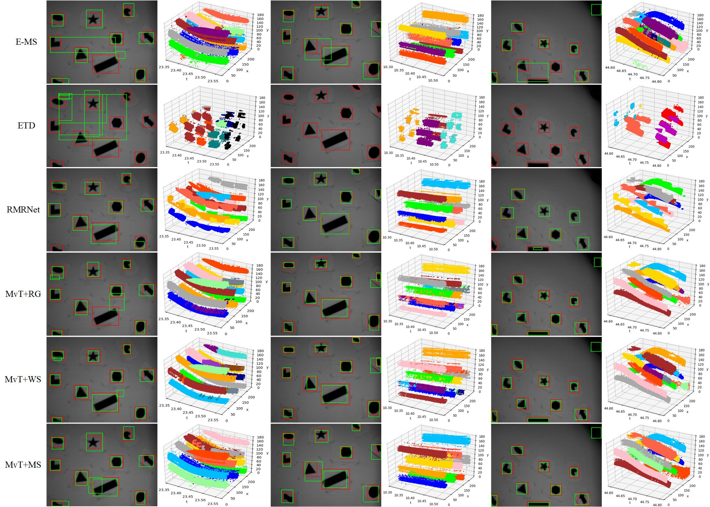
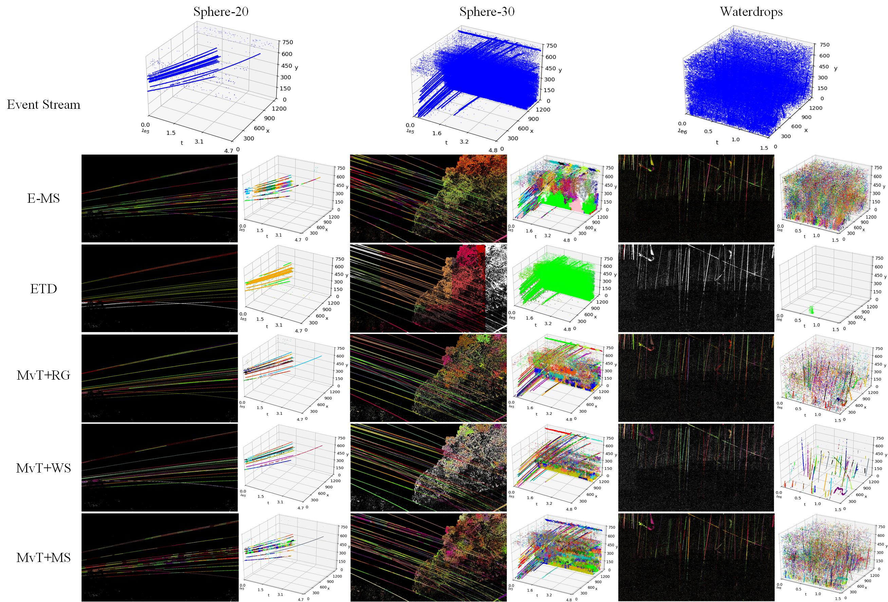

# MvT: Multi-view Tracking
This is the official implementation of《MvT: Event-based Multi-view Projection for
Multiple Object Tracking》using Python.  

## Examples on Experiments 
ECDataset


Small Object Dataset



## Prerequisites
python==3.9.0    
numba  
numpy==1.24.0  
opencv-python==4.10  
opencv-contrib-python  
scikit-learn==1.5.1  
pandas==2.2.2  

## OS
Windows   

## Run
```Python
python src/main.py  
```

## Data Preparation
Data should be put in *'./dataset/{name_of_dataset}/events.txt(csv)'*, or you can change the file path in *src/main.py*.


## Tracking results
All the trajectories will be saved in *'./{name_of_dataset}_show/Tracks'*.


## Visualize trackings
```Python
python visualize/show.py  
```